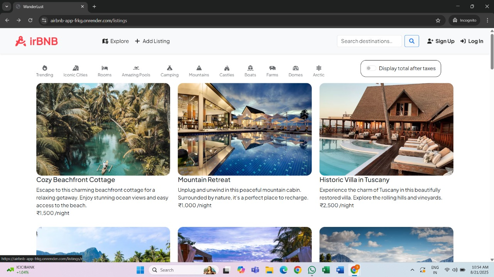

# 🏡 Airbnb Clone – Full Stack Web Application

## 🌟 About the Project

This **Airbnb Clone** is a full-stack web application inspired by Airbnb.  
It allows users to explore listings, register/login securely, and interact with the platform.

The project focuses on **authentication, backend logic, and server-side rendering** using modern web technologies.

---

## 🚀 Features

- 🔐 User authentication using Passport.js
- 📝 User registration & login
- 🏠 Property listings stored in MongoDB
- 📄 Server-side rendering with EJS
- 🗂️ RESTful routes with Express
- 🔒 Secure sessions & cookies
- 📱 Responsive UI

---

## 🛠️ Tech Stack

### Backend
- **Node.js**
- **Express.js**
- **MongoDB**
- **Passport.js (Authentication)**
- **Express Session**

### Frontend
- **EJS (Embedded JavaScript Templates)**
- **HTML, CSS, JavaScript**

### Tools
- **Git & GitHub**
- **MongoDB Atlas / Local MongoDB**

---


## 📸 Screenshots



---

## 📂 Project Setup

```bash
# Clone the repository
git clone https://github.com/your-username/airbnb-clone.git

# Navigate to project folder
cd airbnb-clone

# Install dependencies
npm install

# Start the server  
npm start
```

## 🌐 Live Demo(open this on incognito window)

🔗 https://airbnb-app-frkg.onrender.com

---

## 🎯 Learning Outcomes

- Backend authentication using Passport.js  
- Session management & security  
- MVC architecture  
- EJS templating
- Express routing & middleware  

---

## 🤝 Contributing

Contributions are welcome!  
Feel free to fork this repository and submit pull requests.

---

## 📬 Contact

**Krish Jain**  
📧 Email: krish.jain.civ24@itbhu.ac.in  
🌐 GitHub: https://github.com/KA-rg  

---  

## ⭐ If you like this project, don’t forget to star the repository!
